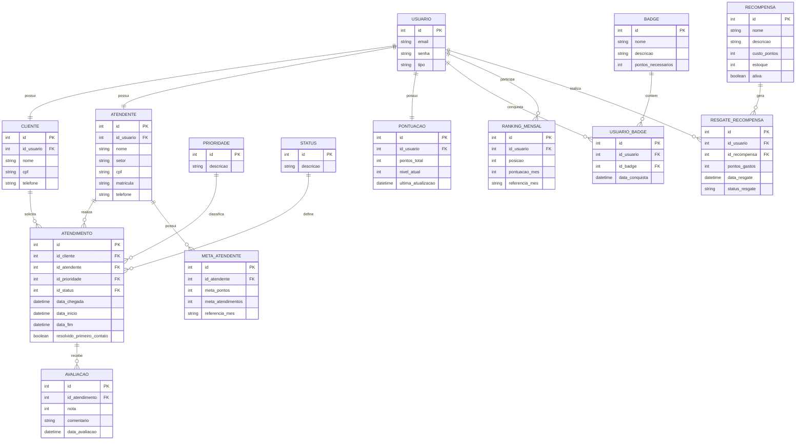

# 🎯 Sistema de Gestão de Atendimento Gamificado (SGA)

## 📌 Descrição do Projeto
Este projeto tem como objetivo desenvolver um sistema de gestão de atendimento com foco em organização de filas, controle de atendimentos e aplicação de técnicas de gamificação para motivar atendentes.

## 🎯 Objetivo Geral
Criar um sistema capaz de:
- Gerenciar clientes e atendentes
- Controlar atendimentos
- Avaliar serviços prestados
- Aplicar pontuação, ranking e recompensas

## 👥 Público-Alvo
- Empresas com atendimento ao cliente
- Call centers
- Clínicas, bancos e suporte técnico

## 🔄 Testes de Atualização

Foram realizados testes de UPDATE simulando:

- Início e finalização de atendimento
- Incremento de pontuação
- Evolução de nível
- Atualização de ranking
- Controle de estoque de recompensas
---

## 🧩 Modelo de Dados

